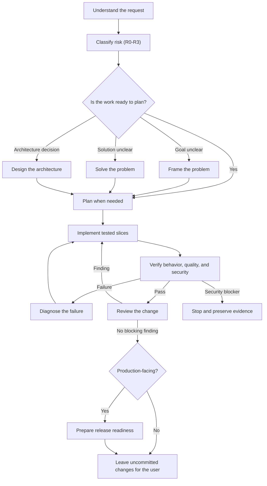

# Personal Development Configuration

This repository contains my personal development setup, with a strong focus on **Python**, which is my main programming language.

⚠️ **Disclaimer**: This setup is tailored for **Windows + Git Bash + VS Code**.


## Installation Guide
### 1. MSYS2
***
MSYS2 is used to bring Unix tools and a Unix-like environment to Windows. While it also provides compilers for C and C++, the main purpose here is to access Unix commands directly from Git Bash or any terminal. You can install MSYS2 using the official installer available [here](https://www.msys2.org/). After the installation, you need to add the following directory to your **PATH** so that the tools are accessible globally:
```text
C:\msys64\ucrt64\bin
```

It is important to note that this setup uses the UCRT64 environment, which is more modern and generally more reliable than the older mingw64 environment.

### 2. Unix Commands
***
Once MSYS2 is installed, you can install the Unix tools required for this setup. Open the UCRT64 terminal, then run the following commands to install:

- make 
    ```bash
    $ pacman -S mingw-w64-ucrt-x86_64-make
    # Creates a symbolic link so we can use make instead of mingw32-make
    $ ln -s /ucrt64/bin/mingw32-make.exe /ucrt64/bin/make.exe 
    ```

- tree
    ```bash
    $ pacman -S tree
    # This ensures the command is accessible correctly due to path differences in the installation
    $ ln -s /usr/bin/tree.exe /ucrt64/bin/tree.exe 
    ```

### 3. UV
***
To manage Python environments and dependencies efficiently, this setup uses [uv](https://docs.astral.sh/uv/), a fast and modern alternative to traditional tools like pip and venv. You can install it using the following command:
```bash
$ powershell -ExecutionPolicy ByPass -c "irm https://astral.sh/uv/install.ps1 | iex"
```

### 4. SSH & GPG Configuration
***
To enhance security and enable features like signing commits and cloning Git repositories, you can set up SSH keys and GPG keys. First of all you will need to [generate an SSH key pair](https://docs.github.com/en/authentication/connecting-to-github-with-ssh/generating-a-new-ssh-key-and-adding-it-to-the-ssh-agent?platform=linux) if you don't have one already:
```bash
$ ssh-keygen -t ed25519 -C "your_email@example.com"
```
You can then add the public key to your Git hosting service to enable SSH authentication.

For GPG, you will need to install [GPG for windows](https://www.gnupg.org/download/) and [generate a GPG key pair](https://docs.github.com/en/authentication/managing-commit-signature-verification/generating-a-new-gpg-key) (It is recommended to use a strong passphrase to protect your GPG key): 
```bash
$ gpg --full-generate-key
```
After generating the key, you can list your keys and get the key ID (value following the protocol for example ed25519/Your_KeyID) using the following command:
```bash
$ gpg --list-secret-keys --keyid-format=long
```
Then you need to export the GPG key id in ASCII format with :
```bash
$ gpg --armor --export Your_KeyID
```
Finally copy your GPG key (with -----BEGIN PGP PUBLIC KEY BLOCK----- and -----END PGP PUBLIC KEY BLOCK-----) and add it to your Git hosting service to enable commit signing.


### 5. Terminal Enhancements
***
To improve the terminal experience, several tools are installed. First, [starship](https://starship.rs/guide/) is used to provide a fast and customizable prompt that adapts to the current project and environment:
```bash
$ winget install -e --id Starship.Starship
```

Next, [fzf](https://github.com/junegunn/fzf) is installed to enable fast fuzzy searching, especially useful for navigating command history and files (**ctrl-r** for search history, **ctrl-t** to search file and **alt-c** to go in a folder):
```bash
$ winget install -e --id junegunn.fzf
```

Then to enhance command-line capabilities, [jq](https://winstall.app/apps/jqlang.jq) is installed for JSON manipulation:
```bash
$ winget install -e --id jqlang.jq
```

Finally, [carapace](https://carapace-sh.github.io/carapace-bin/carapace-bin.html) is installed to provide intelligent command completion and descriptions (**double tab** to get the suggestions):
```bash
$ winget install -e --id rsteube.Carapace
```
Next, you need to place the terminal configuration files in the correct locations to ensure everything works properly. The following files should be placed in your user root directory (C:\Users\Your_User): 
- [.gitconfig](./configs/git/.gitconfig) (where you must set your key ID and name)
- [.bashrc](./configs/bash/.bashrc)
- [.bash_profile](./configs/bash/.bash_profile). 

Additionally, the [starship.toml](./configs/starship/starship.toml) file should be placed in the **.config** directory located in your user root.

### 6. Font Installation
***
To ensure proper rendering of icons and symbols in the terminal (especially with Starship), a Nerd Font is required. You can download fonts [here](https://www.nerdfonts.com/font-downloads) but the recommended font for this setup is:
```text
CaskaydiaMono Nerd Font Mono
```

### 7. VS Code Configuration
***
Now to complete the setup, you need to configure VS Code with the appropriate extensions and settings. First, you will need to install all required extensions using the [extensions.txt](./configs/vscode/extensions.txt) file using:
```bash
$ grep -v '^#' ./configs/vscode/extensions.txt | xargs -L 1 code --install-extension
```

Next, you need to update your Visual Studio Code settings. To do this, open the settings JSON file by pressing Ctrl + Shift + P and selecting "Preferences: Open Settings (JSON)", then add the contents of the [settings.json](./configs/vscode/settings.json) file to your VS Code configuration. Additionally, make sure to update the asset paths with the real absolute paths so that everything works correctly. Finally, for reference, here are the original sources of the background images used in my configuration:

- [mountain](https://fr.freepik.com/images-ia-gratuites/magnifique-paysage-montagneux_133374408.htm#fromView=keyword&page=4&position=33&uuid=fec8b9d8-c64c-4808-82e8-42d1d17a3ac9&query=Montagne+magique)
- [japan_festival](https://wallpapercave.com/w/wp13017680)
- [space](https://www.wallpaperflare.com/universe-space-art-sky-outer-space-galaxy-planet-wallpaper-tycvb/download/720x1280)

### 8. Ollama setup
***

[Ollama](https://ollama.com/download/windows) runs language models locally and exposes an API on `http://localhost:11434`. In this setup, Claude Code sends model requests to that local endpoint instead of the Anthropic API. The desktop version is recommended on Windows because it can keep the Ollama server available in the background. The model still runs on your machine and uses your local CPU, GPU, RAM, and storage.

To install Ollama, start the desktop application, then confirm that the command is available:

```bash
$ ollama --version
```

Now we will download the model that we will use, this configuration uses [`ornith:9b`](https://ollama.com/library/ornith) as its base model (The downloaded model remains in Ollama's local model store and can be reused later without pulling it again):

```bash
$ ollama pull ornith:9b
```

Now we will use the [Modelfile](./configs/claude/ollama/Modelfile) to create a local variant with settings suited to coding-agent work:

```text
FROM ornith:9b

PARAMETER num_ctx 65536
PARAMETER temperature 0.2
PARAMETER top_p 0.9
PARAMETER top_k 20
PARAMETER repeat_penalty 1.05
```

- `num_ctx 65536` provides a larger context for repository files and long conversations.
- `temperature 0.2` favors stable and focused answers.
- `top_p` and `top_k` limit unlikely token choices while preserving useful variation.
- `repeat_penalty` reduces repetitive output.

Create the variant from the repository root:

```bash
$ ollama create claude-ornith:9b -f ./configs/claude/ollama/Modelfile
```

`ollama create` does not fine-tune Ornith or create a new upstream model, it creates a local model definition based on `ornith:9b` with the parameters from the `Modelfile`. Moreover we prefix the name of the created model with  `claude-` so that CLaude code can detect it more easily ( and also prevents confusion between the original `ornith:9b` model) 

### 9. Claude Code
***

Claude Code provides the coding-agent interface. Ollama provides the local model. This repository adds the configuration and workflow that control how the agent understands, modifies, tests, verifies, and reviews code.

The setup contains three parts:

- [settings.json](./configs/claude/settings.json) connects Claude Code to Ollama and configures permissions and model selection;
- [CLAUDE.md](./configs/claude/CLAUDE.md) defines the global engineering and safety contract;
- [skills](./configs/claude/skills) contains the reusable development workflows.

Install Claude Code with `winget`:

```bash
$ winget install Anthropic.ClaudeCode
```

Create the user configuration directory and copy the configuration:

```bash
$ mkdir -p ~/.claude ~/.claude/skills
$ cp ./configs/claude/settings.json ~/.claude/settings.json
$ cp ./configs/claude/CLAUDE.md ~/.claude/CLAUDE.md
$ cp -r ./configs/claude/skills/. ~/.claude/skills/
```

The settings route requests to `http://localhost:11434`, map Claude Code's `opus` selection to `claude-ornith:9b`, enable local model discovery, and expose the model in `availableModels`. Keep Ollama running before starting Claude Code.


For a project-specific workflow, add a `CLAUDE.md` to the repository. Claude Code combines it with the global `~/.claude/CLAUDE.md`. Keep reusable engineering and safety rules global; keep project commands, architecture, conventions, and Definition of Done in the project file.

#### Workflow
***

For non-trivial work, the agent classifies the request and selects the shortest reliable path:



The risk tier determines the amount of evidence required:

- `R0` - local and reversible change;
- `R1` - standard behavior change;
- `R2` - sensitive or cross-cutting change;
- `R3` - critical or hard-to-reverse change.

Every behavior change requires a meaningful test. External APIs use deterministic fakes, mock servers, or sanitized fixtures. Before completion, the agent runs the configured pre-commit mechanism or the repository's equivalent format, lint, type, test, build, and security gates.

#### Skills
***

Skills are small workflow documents. Claude Code first sees their names and descriptions, then loads the complete `SKILL.md` only when a skill is selected. This keeps the global instructions stable while allowing specialized behavior for each situation.

| Phase | Skill | Purpose |
| --- | --- | --- |
| Route | `auto-choose-workflow` | Classify the request, assign its risk tier, and select the shortest reliable flow. |
| Prepare | `bootstrap-project-context` | Discover repository commands, architecture, rules, and project-specific agent context. |
| Prepare | `improve-prompt` | Convert a rough request into a concise execution-ready prompt. |
| Define | `frame-problem` | Clarify the goal, scope, constraints, decisions, and acceptance criteria. |
| Decide | `solve-problem` | Compare solution shapes using evidence and explicit tradeoffs. |
| Design | `design-architecture` | Decide system boundaries, contracts, quality attributes, migration, and rollback. |
| Plan | `plan-change` | Produce ordered vertical slices with tests, risks, dependencies, and evidence. |
| Build | `execute-change` | Modify code in tested slices while keeping the worktree runnable and uncommitted. |
| Diagnose | `diagnose-failure` | Reproduce, isolate, and explain a failure before implementing a fix. |
| Verify | `verify-change` | Prove behavior with security, tests, quality, runtime, and pre-commit evidence. |
| Review | `review-change` | Review a diff, branch, commit range, or PR without publishing comments. |
| Assess | `audit-codebase` | Analyze a codebase or subsystem and prioritize improvements without changing files. |
| Release | `prepare-release-readiness` | Prepare rollout, observability, rollback, and operator evidence without deploying. |

Model-invoked skills can activate automatically when their descriptions match the request. `audit-codebase`, `improve-prompt`, and `bootstrap-project-context` are deliberate user entry points and should be invoked explicitly when you want those workflows.

For a pull-request review, use `/review-change <PR URL or number>`. The skill refreshes refs with `git fetch --prune`, tests the pinned PR branch in a disposable worktree, and can test its uncommitted integration with the pinned base for merge readiness. It reports findings locally, cleans its worktrees, and never commits, pushes, merges, approves, or publishes a review.
